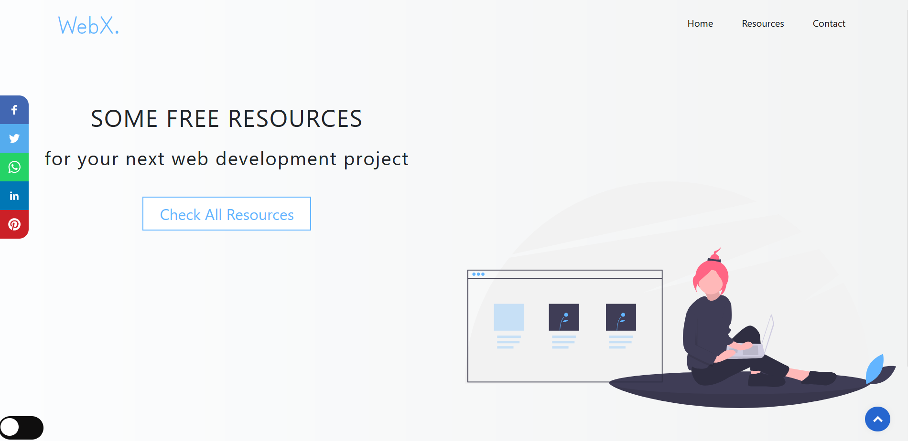
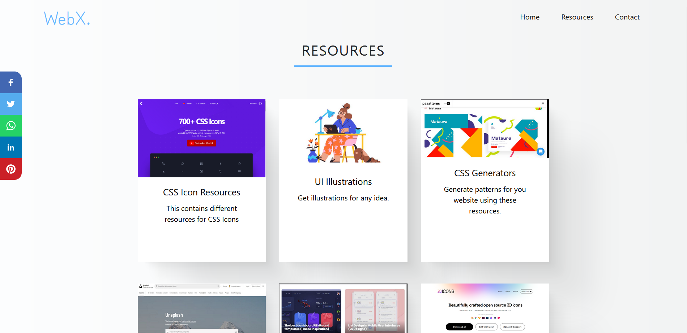
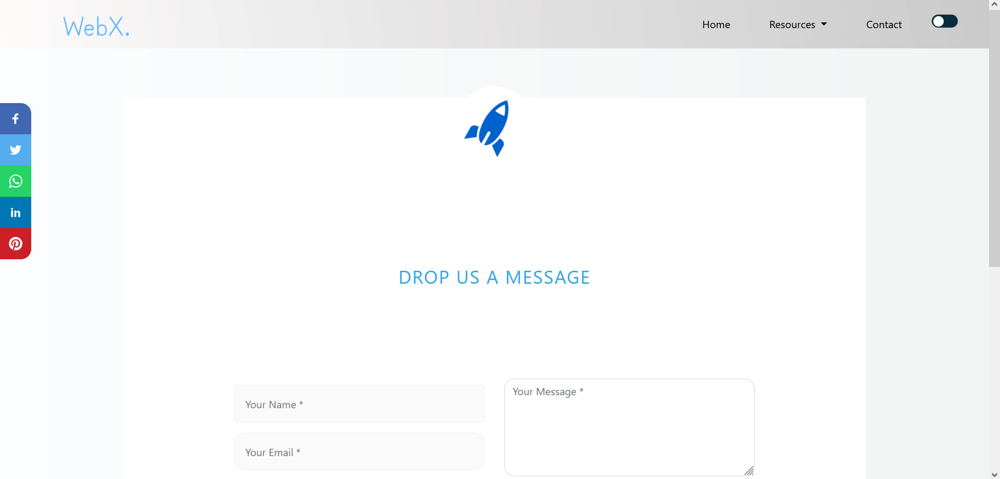

# WebX

WebX is a website which focuses on providing various free frontend web development tools and inspiration all at one place.
 ### You can Have a look at website [**here**](https://yashikabhargava.github.io/WebX/) 

# Built with

  

# Contribution is fun!

In order to make a hassle-free environment, I implore you all (_while contributing_) to follow the [Code of Conduct](https://github.com/yashikabhargava/WebX/blob/main/CODE_OF_CONDUCT.md) and read the [contribution guidelines](https://github.com/yashikabhargava/WebX/blob/main/Contributing.md).

Happy Submissions!
  
# Screenshots

 

 

  
